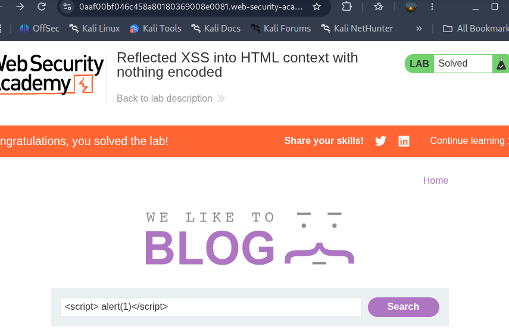

## LAB 1 WRITEUP

 * vulnerability type   :- REFLECTED XSS 
 * LAB TOPIC            :- Reflected xss into html context with nothing encoded 
  
 *  STEPS  
  
  1. Access  the lab and view search bar top of the  blog post 
  2. just simply use 
  3. and press enter

 * IMPACT  :- The payload sent thorugh url parameter . the application reflects into the html response without encode causing intrept and execute injected java script 
   

   